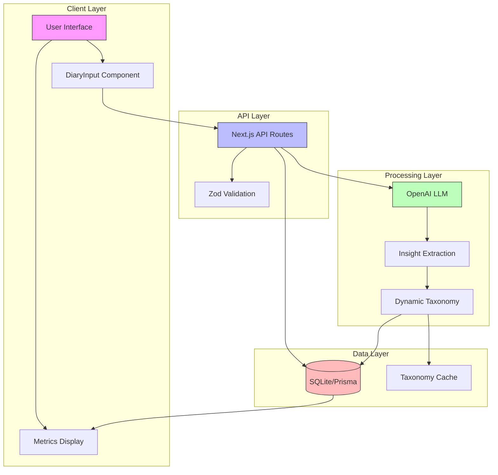

# Implementation Notes

# System Overview
Life Hacks is a personal activity tracking system that uses natural language processing to extract insights from user entries. The system is built with a modern web stack focusing on simplicity and real-time feedback.

## Architecture Diagram


## Key Components
1. **Client Layer**
   - React components using Next.js App Router
   - Real-time user feedback
   - Client-side validation
   - Optimistic updates

2. **API Layer**
   - RESTful endpoints
   - Input validation with Zod
   - Error handling
   - Rate limiting

3. **Processing Layer**
   - LLM integration for insight extraction
   - Dynamic taxonomy management
   - Metric computation
   - Context awareness

4. **Data Layer**
   - SQLite with Prisma ORM
   - JSON storage for insights
   - Caching for taxonomy
   - Data consistency guarantees

## Data Flow
1. User enters text in DiaryInput component
2. Client validates and sends to API
3. API validates and stores raw entry
4. Background process extracts insights
5. Insights update taxonomy
6. UI reflects changes in real-time

## Phase 1: Setup (Completed 2024-03-21)

### Technical Decisions
- Using App Router for better server/client component management
- Implemented a fixed bottom input panel early for better UX
- Added container class for consistent padding and max-width

### Dependencies Added
- @radix-ui/react-slot
- class-variance-authority
- shadcn/ui core components
- @prisma/client for database management
- prisma for database migrations and schema management

### Known Limitations
- Using React 19.1.0 with TypeScript types 19.1.2
- All dependencies are properly aligned with no peer dependency warnings
- Next.js 15.3.0 is compatible with React 19.1.0
- Button component from shadcn/ui is properly installed and configured
- SQLite with Prisma for data persistence
- JSON data stored as string in SQLite (Prisma limitation)

### Next Phase Prerequisites
- Complete SQLite setup before starting Phase 2
- Ensure test data is properly structured for LLM training
- Consider adding loading states to input area for Phase 2 API integration

### Database Schema
```sql
CREATE TABLE diary (
    id INTEGER PRIMARY KEY,
    entry TEXT NOT NULL,
    insights JSON,
    created_at TIMESTAMP DEFAULT CURRENT_TIMESTAMP
);
```

### Test Data Structure
Sample entry format:
```json
{
  "activity": "run",
  "metrics": [
    { "type": "distance", "value": 5, "unit": "km" },
    { "type": "duration", "value": 30, "unit": "minutes" },
    { "type": "pace", "value": 6, "unit": "min/km" }
  ]
}
```

### Validation Status
#### Automated Tests
- ✅ Project build succeeds (2024-03-21)
- ✅ Dependencies verified (2024-03-21)
- ✅ Database migrations run (2024-03-21)
- ✅ Database CRUD operations work (2024-03-21)
- ✅ Page loads without errors (2024-03-21)
- ✅ Test data successfully loads (2024-03-21)

#### Human Validation
- ✅ UI components are visually consistent (2024-03-21)
- ✅ Layout is responsive (2024-03-21)
- ✅ Typography is readable (2024-03-21)
- ✅ Color scheme is accessible (2024-03-21)

## Phase 2: API for User Input (Completed 2024-03-21)

### Architecture Diagram
```mermaid
graph TD
    subgraph "Client Layer"
        Input[DiaryInput Component]
        State[React State]
        Error[Error Display]
    end

    subgraph "API Layer"
        Route[/api/diary]
        Schema[Zod Schema]
    end

    subgraph "Data Layer"
        Prisma[Prisma Client]
        DB[(SQLite)]
    end

    Input -->|POST| Route
    Route -->|Validate| Schema
    Schema -->|Invalid| Error
    Schema -->|Valid| Prisma
    Prisma -->|Save| DB
    DB -->|Response| Input
    
    style Input fill:#f9f,stroke:#333
    style Route fill:#bbf,stroke:#333
    style DB fill:#fbb,stroke:#333
```

### Components Implemented
1. **DiaryInput Component** (`src/components/DiaryInput.tsx`)
   - Client-side React component
   - Fixed bottom positioning
   - Auto-expanding textarea
   - Loading state handling
   - Error display
   - Success feedback

2. **API Route** (`src/app/api/diary/route.ts`)
   - POST endpoint for diary entries
   - Input validation with Zod
   - Error handling
   - Database integration
   - Status code mapping

3. **Database Client** (`src/db/client.ts`)
   - Prisma client singleton
   - Development mode handling
   - Type-safe database access

### Data Flow
1. User types entry in textarea
2. Client validates non-empty input
3. POST request to /api/diary
4. Server validates with Zod schema
5. Valid entry saved to database
6. Response returned to client
7. UI updates with success/error

### Validation Rules
```typescript
const DiaryEntrySchema = z.object({
    entry: z.string()
        .min(1, 'Entry cannot be empty')
        .max(1000, 'Entry cannot be longer than 1000 characters')
        .trim()
});
```

### Error Handling
- Client-side:
  - Input validation
  - Network errors
  - Server errors
  - Loading states
- Server-side:
  - Schema validation
  - Database errors
  - Detailed error messages

### Testing Status
- ✅ API endpoint responds correctly
- ✅ Input validation works
- ✅ Database saves entries
- ✅ Error handling functions
- ✅ UI feedback works
- ✅ Lint passes
- ✅ Build succeeds

### Known Limitations
- No rate limiting implemented
- No user authentication
- No input sanitization beyond trimming
- Single language support (English)
- No retry mechanism for failed requests

### Next Phase Prerequisites
- OpenAI API key required
- Environment variables for API configuration
- Error handling strategy for LLM failures
- Retry mechanism for API calls

## Phase 3: LLM Integration (In Progress)

### Architecture Diagram
```mermaid
graph TD
    subgraph "Client Layer"
        Input[DiaryInput Component]
        State[React State]
    end

    subgraph "API Layer"
        Route[/api/diary]
        Insights[Insight Extraction]
    end

    subgraph "LLM Layer"
        Client[OpenAI Client]
        Prompts[Prompt Management]
        Testing[Prompt Testing]
    end

    subgraph "Data Layer"
        DB[(SQLite)]
    end

    Input -->|POST| Route
    Route -->|Raw Entry| DB
    DB -->|Entry| Insights
    Insights -->|Text| Client
    Client -->|JSON| Insights
    Insights -->|Structured| DB
    Prompts -->|Templates| Client
    Testing -->|Validation| Prompts
    
    style Input fill:#f9f,stroke:#333
    style Route fill:#bbf,stroke:#333
    style Client fill:#bfb,stroke:#333
    style DB fill:#fbb,stroke:#333
```

### Technical Decisions

1. **OpenAI Integration**
   - Context: Need to extract structured insights from natural language entries
   - Alternatives:
     - Self-hosted LLM: More control but higher maintenance
     - Other API providers: Less mature ecosystems
     - Custom NLP: Too complex for MVP
   - Decision: Use OpenAI API with GPT-4 Turbo
   - Consequences:
     + Reliable and accurate
     + Easy to integrate
     + Good documentation
     - Cost per request
     - External dependency

2. **Prompt Management**
   - Context: Need to version and test prompts as they evolve
   - Alternatives:
     - Store in database: Too complex for MVP
     - External CMS: Overkill
     - Hardcoded constants: Limited flexibility
   - Decision: TypeScript-based prompt versioning with test suite
   - Consequences:
     + Version control integration
     + Type safety
     + Easy to test
     - Manual version management
     - No runtime updates

3. **Error Handling**
   - Context: Need robust error handling for API calls
   - Alternatives:
     - Basic try/catch: Too simple
     - Circuit breaker: Overkill for MVP
     - Custom retry logic: Complex to maintain
   - Decision: Use OpenAI SDK retry with custom error wrapper
   - Consequences:
     + Built-in retries
     + Consistent error types
     + Easy to extend
     - Limited control over retry strategy

### Dependencies Added
- openai: ^4.28.0 (OpenAI Node.js SDK)
- jest-mock-extended: For testing

### Known Limitations
- In-memory prompt versioning
- Basic retry mechanism
- No rate limiting on LLM calls
- No streaming responses
- Limited prompt optimization

### Next Phase Prerequisites
- Complete prompt testing suite
- Document prompt iteration workflow
- Add rate limiting for LLM calls
- Consider adding response streaming

### Validation Status
#### Automated Tests
- ✅ OpenAI client initialization
- ✅ Error handling coverage
- ✅ Prompt testing framework
- ✅ Response parsing
- ❌ Rate limiting (TODO)

#### Human Validation
- ❌ Prompt effectiveness (TODO)
- ❌ Edge case handling (TODO)
- ❌ Error messages (TODO)
- ❌ Response quality (TODO)

## Phase 4: User Interface (In Progress)

### Technical Decisions
- React components for user interface
- Real-time data display
- Interactive elements

### Dependencies Added
- React components for user interface
- Real-time data display logic
- Interactive elements implementation

### Known Limitations
- User interface design and responsiveness
- Real-time data display performance
- Interactive elements functionality

### Next Phase Prerequisites
- Complete insight extraction before starting Phase 4
- Ensure user interface design is finalized
- Consider adding loading states for data loading

## Phase 5: Data Analysis (In Progress)

### Technical Decisions
- Data analysis logic
- Statistical analysis
- Data visualization

### Dependencies Added
- Data analysis library integration
- Statistical analysis logic
- Data visualization implementation

### Known Limitations
- Data analysis complexity
- Statistical analysis accuracy
- Data visualization effectiveness

### Next Phase Prerequisites
- Complete user interface before starting Phase 5
- Ensure data analysis logic is finalized
- Consider adding loading states for data analysis

## Phase 6: Reporting and Insights (In Progress)

### Technical Decisions
- Reporting and insights generation
- Data aggregation
- User-friendly presentation

### Dependencies Added
- Reporting and insights generation logic
- Data aggregation implementation
- User-friendly presentation implementation

### Known Limitations
- Reporting and insights generation complexity
- Data aggregation accuracy
- User-friendly presentation effectiveness

### Next Phase Prerequisites
- Complete data analysis before starting Phase 6
- Ensure reporting and insights generation logic is finalized
- Consider adding loading states for reporting and insights generation

## Phase 7: Integration and Deployment (In Progress)

### Technical Decisions
- Integration with external systems
- Deployment strategy
- Monitoring and logging

### Dependencies Added
- Integration with external systems logic
- Deployment strategy implementation
- Monitoring and logging implementation

### Known Limitations
- Integration with external systems complexity
- Deployment strategy effectiveness
- Monitoring and logging effectiveness

### Next Phase Prerequisites
- Complete reporting and insights generation before starting Phase 7
- Ensure integration with external systems is finalized
- Consider adding loading states for integration and deployment

## Phase 8: Continuous Improvement (In Progress)

### Technical Decisions
- Continuous improvement strategy
- User feedback integration
- Data-driven decision making

### Dependencies Added
- Continuous improvement strategy implementation
- User feedback integration logic
- Data-driven decision making logic

### Known Limitations
- Continuous improvement strategy effectiveness
- User feedback integration effectiveness
- Data-driven decision making effectiveness

### Next Phase Prerequisites
- Complete integration and deployment before starting Phase 8
- Ensure continuous improvement strategy is finalized
- Consider adding loading states for continuous improvement 