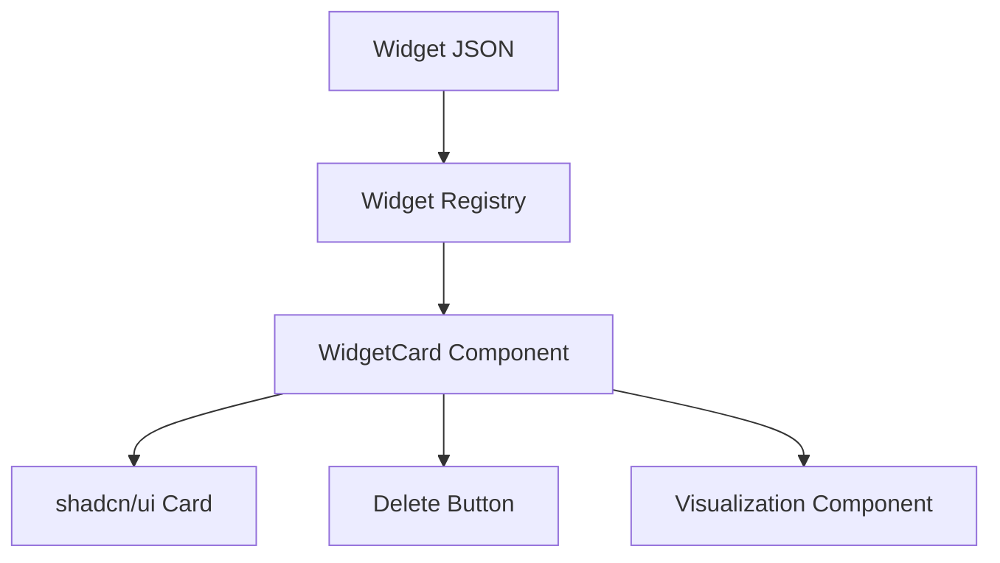

# Life Hacks: AI-Powered Personal Diary & Fitness Tracker

# Problem Statement

## What Problem Are We Solving?

Modern knowledge workers, fitness enthusiasts, and everyday individuals often struggle to keep track of their daily activities, fitness progress, and personal insights in a way that is both flexible and actionable. Existing apps are either too rigid (forcing users into predefined forms), too unstructured (making data retrieval and visualization difficult), or too complex for single-user, day-to-day use.

**We are building an app that enables users to:**
- Seamlessly log diary entries, workouts, and life events in natural language.
- Automatically extract structured data from these entries using AI, making it easy to visualize trends and insights.
- Create and manage custom visualizations (“widgets”) simply by describing them in plain English.
- Maintain a minimal, distraction-free, single-user experience with zero setup.

---

# MVP Use Cases & User Stories

## 1. Gym/Workout Tracking

**User Stories:**
- As a user, I want to log my workouts in natural language (“Lifted 20kg for biceps, 3 sets of 10 reps”) so that I don’t have to fill out tedious forms.
- As a user, I want to see charts and summaries of my progress (e.g., “Show my bench press progress over the last month”) so I can stay motivated.
- As a user, I want to create new visualizations (e.g., “Create a chart comparing my squat and deadlift weights”) without learning complex tools.
- As a user, I want to delete visualizations I no longer need, either by clicking a delete button or typing a command (“Delete the cardio summary widget”).

## 2. Personal Diary & Life Logging

**User Stories:**
- As a user, I want to quickly jot down thoughts, events, or reflections in a single input box, without worrying about structure.
- As a user, I want the app to automatically extract key entities (mood, activities, people, etc.) from my entries so I can later search or visualize them.
- As a user, I want to generate visual summaries (e.g., “Show a timeline of my moods this month”) directly from my diary data.
- As a user, I want to manage my widgets (create/delete) using natural language or simple UI actions.

---

# Architecture Overview

## System Components

- **Frontend:** Next.js (React-based), deployed on Vercel. Uses shadcn/ui (Radix UI + Tailwind CSS) for a modern, minimal interface.
- **Backend:** Next.js API routes (serverless functions) handle data processing, LLM integration, and database access.
- **Database:** SQLite (for MVP) stores all diary entries, structured data, and widget metadata.
- **LLM Integration:** Server-side API calls to a cloud LLM (e.g., OpenAI) or self-hosted model for structure extraction and widget generation.

## Data Flow

```mermaid
flowchart TD
    A[User Input (Diary/Command)] --> B[Frontend (Next.js)]
    B --> C[API Route (Serverless)]
    C --> D[LLM Service]
    C --> E[SQLite Database]
    D --> C
    C --> B
    E --> C
    B --> F[UI Update (Widgets, Diary, Visualizations)]
```

- User submits text (entry, widget request, or widget deletion) via the input box.
- Frontend sends the entry to a Next.js API route.
- API route saves the entry to SQLite and sends it to the LLM for structure extraction or widget generation.
- LLM returns structured data or widget JSON.
- API route updates the database with structured data or widget metadata.
- Frontend retrieves and displays updated diary entries and widgets.

## Widget Rendering



- Widget JSON is mapped to the appropriate React component via a registry.
- Each widget is displayed in a card with a title and a delete button.

---

# UI/UX Details

- **Single Input Box:** For all diary entries, widget creation, and deletion commands.
- **Input Parsing:** The input box will use simple keyword-based parsing to distinguish between diary entries, widget creation (e.g., 'create a chart of...'), and widget deletion (e.g., 'delete the ... widget'). Placeholder and help text will guide users.
- **Main Area:** Scrollable presentation of diary entries and widgets (charts, tables, etc.).
- **Widget Management:**  
  - Create widgets by describing them in the input box.
  - Delete widgets via a delete button or by typing a command.
  - Widgets are arranged in a vertical list. Widget layout and state are persisted in the database and restored on reload. (No reordering in MVP.)
- **UI Feedback:** Loading spinners and error/success notifications will be shown for all async actions. Empty states will be handled gracefully.
- **State Management:** UI state for entries, widgets, loading, and errors will be managed using React context or local state.
- **No voice, reminders, calendar, multi-user, or accessibility features in MVP. Accessibility is explicitly excluded.**
- **Minimal, modern design using shadcn/ui and Tailwind CSS.**

---

# JSON-to-Widget Rendering

- **Component Registry:** Maps each widget JSON `type` (e.g., `line_chart`, `table`) to a React component.
- **WidgetCard Pattern:** Generic card component receives widget JSON, looks up the correct visualization, and renders it inside a shadcn/ui Card with a delete button.
- **Error Handling:** If widget type is unrecognized or JSON is malformed, display an error message in the card.
- **Extensibility:** New widget types can be added by defining new React components and updating the registry.

---

# Technical Architecture (Details)

- **Frontend:** Next.js (Vercel), shadcn/ui, Tailwind CSS.
- **Backend:** Next.js API routes for all data and LLM processing.
- **Database:** SQLite for MVP (easy local dev, simple deployment). See below for schema details.
- **LLM:** Server-side calls to OpenAI or similar for extraction/generation.
- **Single User Only:** No auth, sharing, or multi-user support.

---

# Implementation & Quality Details

## API Validation & Security
- All API inputs will be validated and sanitized server-side to prevent injection or malformed data.
- Basic rate limiting will be enforced on API endpoints.
- No authentication or user management in MVP.

## Error Handling & Logging
- All backend errors will be logged to the console and, in production, to a persistent log.
- User-facing errors will be surfaced in the UI.

## Testing
- Unit and integration tests will be written for API routes, database logic, and core UI flows.

## LLM Prompt Design & Error Handling
- Prompts for the LLM will be iterated and versioned for clarity and accuracy.
- LLM timeouts, ambiguous or failed responses will be handled gracefully; users will be notified of failures.

## SQLite Schema Design
- Tables: `entries` (raw text, timestamp), `structured_data` (parsed entities, foreign key to entry), `widgets` (type, config, layout, metadata).
- Schema migrations will be managed using a migration tool or SQL scripts.

## Documentation
- API endpoints and data models will be documented for maintainers.
- A user guide/onboarding section will be included in the README.

## Deployment
- Deployment will be verified on Vercel after each major change.

## Accessibility
- Accessibility is explicitly excluded from the MVP scope.

---

# Summary

This MVP delivers a single-user, AI-powered journaling and visualization app. Users can log anything in natural language, and the app intelligently extracts structure and generates visualizations on demand. Widget management is simple and conversational. The technical stack is modern, minimal, and highly maintainable.


## 1. Gym/Workout Tracking

**Overview:**
A core use case for users who want to log, track, and visualize their physical exercise routines and progress.

**Key Features:**
- Log workouts using natural language (e.g., "Lifted 20kg for biceps, 3 sets of 10 reps").
- Track details: exercise name, weight, reps, sets, duration, rest intervals, notes, and date/time.
- Visualize progress over time (e.g., weight lifted, reps, workout frequency, personal bests).
- Weekly/monthly summaries and charts.
- Delete or create new workout visualizations (widgets) via the input box.

**Example User Actions:**
- "Log 4 sets of squats, 30kg, 12 reps each."
- "Show my bench press progress this year."
- "Create a chart comparing my squat and deadlift weights."
- "Delete the cardio summary widget."

---

## 2. Family & Kids Organization (Optional/Future)

**Overview:**
A possible future use case for organizing and tracking kids’ activities, chores, and milestones. Not included in the MVP; current app is single-user only.

---

## Diary Entry & Data Extraction (MVP)

**Entry Method:**  
- All diary entries and widget requests are made via a single text input box.
- Each entry is timestamped and saved as-is to the diary (raw log).

**Widget Creation/Deletion:**
- Users can create new visualizations (widgets) by describing them in the input box (e.g., "Create a chart of my weekly running distance").
- Users can delete existing widgets via a delete button on each widget card or by describing the deletion in the input box (e.g., "Delete the calories widget").

**Automatic Structure Extraction:**  
- An LLM (Large Language Model) processes each entry to extract structured entities/attributes (e.g., mood, activity, exercise data).
- Extracted structured data is saved alongside the raw entry.
- To ensure consistency in naming (e.g., “workout” vs. “exercise”), the LLM is provided with an aggregation of previously extracted structures for reference during extraction.

**Unified Input/Editing:**  
- The same text box is used for inserting new entries, creating widgets, and editing the current view.

**UI Layout:**  
- The main area of the UI is dedicated to presenting diary content and visualizations.
- The lower fifth of the screen is reserved for the input box.

**Wireframe Depiction:**

```
+--------------------------------------------------+
|                                                  |
|            Diary Content / Visualizations        |
|            (main presentation area)              |
|                                                  |
|                                                  |
|                                                  |
+--------------------------------------------------+
| [    Type your entry or command here...      ] 📨 |
|          (Input box, lower fifth)                |
+--------------------------------------------------+
```

- The top ~80% of the screen is the scrollable presentation area for diary entries, visualizations, summaries, etc.
- The bottom ~20% is a persistent input box for new entries, widget creation, editing, and commands.
- The input box can include a send button (📨).

**UI Framework Choice:**

- The app will use **shadcn/ui** as its main UI framework for the presentation and visualization layer.
- shadcn/ui offers a modern, minimal, and highly customizable set of React components built on Radix UI and Tailwind CSS, allowing for a flexible, non-corporate look that fits the adaptive and conversational nature of the app.
- Visualizations and interactive components will be implemented using shadcn/ui components, with custom styling as needed to match the product vision.

**Sample Gym Visualization Requests:**

Users may ask the system to display or manage:
- “Show my bench press progress over the last month.”
- “Display a chart of total weight lifted per week.”
- “Delete the squat chart.”
- “Create a table of my longest cardio sessions.”
- “Compare my squat and deadlift weights.”
- “Visualize my workout frequency by day of week.”
- “List my personal bests for each exercise.”

---

## JSON-to-Widget Rendering Approach

To render visualizations and widgets from LLM-generated JSON, the app uses a registry and a generic card pattern:

**1. Component Registry**
- Maintain a mapping between each JSON `type` (e.g., `line_chart`, `table`) and a corresponding React widget/component that knows how to render that data.
- Example:
  ```js
  const widgetRegistry = {
    line_chart: LineChartWidget,
    bar_chart: BarChartWidget,
    table: TableWidget,
    // ...add more as needed
  };
  ```

**2. Standardized JSON Schema**
- Require that all LLM outputs for widgets follow a standard schema:
  - `type`: visualization type (e.g., `line_chart`, `table`)
  - `title`: string for card header
  - `data`: main data payload (array or object)
  - Additional fields as needed (`xAxis`, `yAxis`, `columns`, etc.)

**3. WidgetCard Pattern**
- Implement a generic `WidgetCard` React component that:
  - Receives the JSON
  - Looks up the correct widget via the registry
  - Renders the widget inside a shadcn/ui `Card`, with the title
  - Includes a delete button to remove the widget
- Example:
  ```tsx
  <Card>
    <CardHeader>
      <CardTitle>{widgetJson.title}</CardTitle>
      <DeleteButton onClick={...} />
    </CardHeader>
    <CardContent>
      <WidgetComponent {...widgetJson} />
    </CardContent>
  </Card>
  ```

**4. Extensibility & Error Handling**
- New visualization types can be added by defining new React components and updating the registry.
- If a widget type is unrecognized or JSON is malformed, show an error message in the card.
- This approach keeps rendering logic modular, scalable, and easy to maintain.

---

## Technical Architecture

**Frontend:**
- Built with Next.js (React-based), deployed on Vercel.
- Uses shadcn/ui (Radix UI + Tailwind CSS) for UI components and styling.
- Handles all user interaction, diary entry, and widget management.

**Backend & Database:**
- SQLite database for all diary entries, structured data, and widget metadata (MVP).
- Next.js API routes or serverless functions handle database access and LLM integration.
- All LLM processing (for structure extraction and widget generation) is performed server-side, either via API calls to a cloud LLM provider (e.g., OpenAI) or a self-hosted model.

**Data Flow:**
- User submits text via input box (entry, widget request, or widget deletion).
- Entry is saved to the database.
- LLM processes entry and returns structured data or widget JSON.
- Frontend updates the presentation area with new/updated widgets or entries.
- Widget deletion is handled via UI (delete button) or input command, removing the widget from the database and UI.

**Single User Only:**
- No authentication, sharing, or multi-user support.
- No accessibility features are included in the MVP.

---

This MVP focuses on a single-user journaling and visualization app with LLM-powered data extraction and flexible, user-driven widget management.
